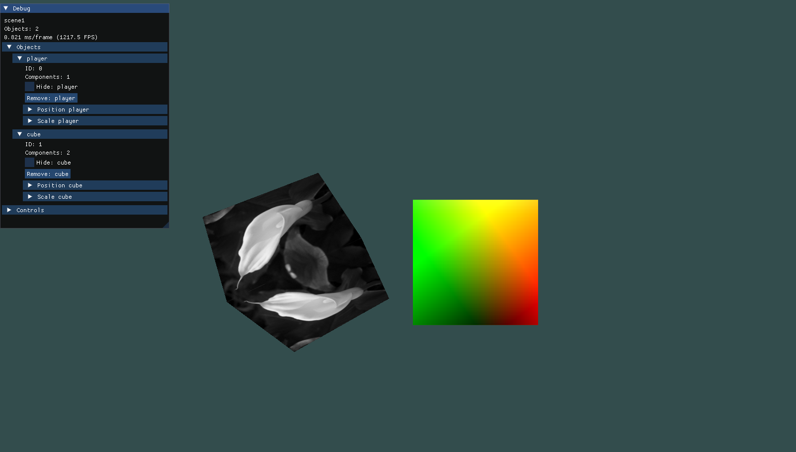

# C++ OpenGL Game Engine
# Build Instructions
Open the visual studio solution and select build. include and lib folder should be pre-linked and using the relative folders.

# Features:
- Easy To Use Debug GUI, allowing for manipulation of scene objects.
- Simple Entity Component System, allowing developers to implement gameplay faster.
- Render Objects with Textures through a simple renderer.

# Dependencies
- GLFW
- STB
- GLM
- ASSIMP
- Dear ImGui

# Gameplay Examples
In Application



# Development Patterns Utilised
### Singletons And Managers
The application utilises singleton managers for the main components.
For example, the SceneManager class allows any code within the applciation to access and modify the current scene without having direct access to the scene itself. 
This is to prevent code from accidentally modifying the scene in illegal ways to prevent errors from occuring.

### Entity Component System
Each GameObject can have multiple components attached to it. Each Component contains a start and update loop allowing for code to be written once and be re-used throughout as a component.

Application Diagram \


# Scene Manager
The scene manager is used to control the current scene throughout the application. It contains all functions related to adding, removing, retrieving and updating GameObjects.
```
SceneManager::get()
```

# Input Manager
The input manager allows access the keyboard controls. 
This class is built to be expandable in the future utilising as much of the GLFW input library as possible, 
this is to be able to implement more input types, such as controllers or touchscreen, in the future.
```
InputManager::get().GetKeyPressed();
InputManager::get().GetKeyDown();
```


Currently, two different types of input are monitored:
- Key Down, which checks if the key is currently down.
- Key Pressed, which checks if the key has been pressed but is no longer down in the last frame.


# Renderer
The renderer contains all the code related to rendering the current scene.
It is specifically designed to be self contained and have no external influences. 

The main loop of the renderer loops through all the objects in the scene and renders them to the OpenGL buffer. 
In this loop, it is also checked if the object is hidden in the scene.

# User Interface
The user interface uses the Dear ImGui library for its simplicity and integration with GLFW and OpenGL.

Dear ImGui is an immediate mode GUI library and as a result, doesn't utilise callbacks. Instead, it is updated with all the other systems in the main loop.


# GameObject
GameObjects consist of 3 main components:
- The Rendering Logic and Mesh, Texture, Position, Rotatation and Scale data.
- The Updating Logic.
- The Components and Component System.

The Start and Update function are called through the SceneManager when in the current scene. 
The update function also contains a deltaTime variable to keep time seperate from framerate.

# Components
Retreving components from a GameObject was more complicated than initially thought as they are all stored in one std::vector as the parent class type.
To solve this, templates were used to specify the class of the component it will be cast to when retrieving the component. 

This allows the developer to access all variables and functions of the child type.  

```
Child* child = GetComponent<Child>();
```

In the application there are 3 example components: 
- Player, this component allows the player to control the player GameObject using the keyboard through the InputManager. 

- Rotate, this will rotate the object selected. 
- Move, this will move the selected object.

These example components are used to show how the system works and how they can be combined on the same object.

### An example object
```
GameObject* object = new GameObject("texture_path");
object.AddComponent(new Player());
Player* player = object.GetComponent<Player>(0);
```

# Evaluation
Overall i feel the project was overscoped in the initial documents.
Moving over to C++ and OpenGL programming was a far more difficult transition than i initially believed and as a result the project suffered because of it.

On the other hand, this project has allowed me to learn a lot about the components of a game and game engine.